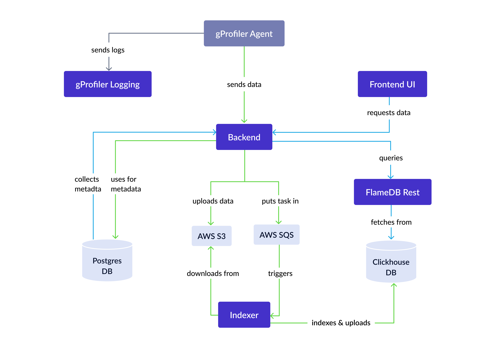

# About
Continuous production profiling, made easy (for the cloud version, which is also free, use [Intel Continuous Profiler](https://profiler.granulate.io)).

An open-source, continuous profiler for production – across any environment, at any scale.

Developed by Intel® Granulate™ and contributed to the open source community, Continuous Profiler is a solution that combines multiple profilers into one view as a flame graph. 
This unified view offers developers, performance engineers and DevOps a continuous and autonomous way to identify runtime inefficiencies.

https://granulate.io/continuous-profiling/

# Continuous Profiler

The evolution of Continuous Profiler, Continuous Profiler combines multiple sampling profilers to produce a unified visualization of what a CPU is spending time on. Easy-to-navigate flame graphs pinpoint performance regressions, such as garbage collection, deadlocks and others to help smooth deployments.

The profiler is compatible with Intel Granulate’s continuous optimization services and can be deployed cluster-wide within minutes, supporting a range of programming languages without requiring code changes. 

Continuous Profiler is SOC2-certified and held to Intel's high security standards, ensuring reliability and trust in its deployment.


This project offers a backend and user interface for the [Continuous Profiler agent](https://github.com/Granulate/gprofiler),
featuring advanced flamegraph analysis tools.


## Table of Contents

- [System Overview](#system-overview)
- [Usage](#usage)
- [Managing the stack](#managing-the-stack)
- [Local running and development](#local-running-and-development)


## System Overview

The Continuous Profiler is structured around several key microservices,
each playing a vital role in its functionality:

- `src/gprofiler/backend` - This is the web application backend. It exposes all APIs to the frontend or API users and is responsible for collecting data from agents.
- `src/gprofiler/frontend` - The User Interface of Continuous Profiler, facilitating interaction with the backend.
- `src/gprofiler_indexer` - This service is tasked with collecting raw profiling data from S3 storage and indexing it for ClickHouse, a database management system.
- `src/gprofiler_flamedb_rest` - Handles communication with ClickHouse for the purpose of constructing flamegraphs.
- `src/gprofiler_logging` - Dedicated to collecting logs from agents, ensuring a comprehensive logging system.

This architecture allows for efficient handling and analysis of profiling data, providing users with an intuitive and powerful tool for performance analysis.

### External Dependencies: AWS Services
The Continuous Profiler incorporates specific AWS services as essential components.
These dependencies are:

- Amazon S3 (Simple Storage Service): Used extensively for storing profiling data.

- Amazon SQS (Simple Queue Service): Integral for managing message queues between backend and indexer services.

You are welcome to replace those services with other similar which implement the same API,
like Minio for S3 and RabbitMQ for SQS.

## Usage

### Pre-requisites
Before using the Continuous Profiler, ensure the following:
- You have an AWS account and configure your credentials, as the project utilizes AWS SQS and S3.
- You'll also need to create an SQS queue and an S3 bucket.
- You have Docker and docker-compose installed on your machine.


#### Security
By default, the system is required to set a basic auth username and password;
you can generate it by running the following command:
```shell
# assuming that you located in the deploy directory
htpasswd -B -C 12 -c .htpasswd <your username>
# the prompt will ask you to set a password
```
This file is required to run the stack

Also, a TLS certificate is required to run the stack,
see [Securing Connections with SSL/TLS](#securing-connections-with-ssltls) for more details.


### Running the stack
To run the entire stack built from source, use the docker-compose project located in the `deploy` directory.

The `deploy` directory contains:
- `docker-compose.yml` - The Docker compose file.
- `.env` - The environment file where you set your AWS credentials, SQS/S3 names, and AWS region.
- `https_nginx.conf` - Nginx configuration file used as an entrypoint load balancer.
- `diagnostic.sh`- A script for testing connectivity between services and printing useful information.
- `tls` - A directory for storing TLS certificates (see [Securing Connections with SSL/TLS](#securing-connections-with-ssltls)).
- `.htpasswd` - A file for storing basic auth credentials (see above).

To launch the stack, run the following commands in the `deploy` directory:
```shell
cd deploy
docker-compose --profile with-clickhouse up -d --build
```

Check that all services are running:
```shell
docker-compose ps
```

You should see something like this
```shell
NAME                               IMAGE                               COMMAND                  SERVICE               CREATED         STATUS         PORTS
gprofiler-ps-agents-logs-backend   deploy-agents-logs-backend          "./run.sh"               agents-logs-backend   4 minutes ago   Up 4 minutes   80/tcp
gprofiler-ps-ch-indexer            deploy-ch-indexer                   "/indexer"               ch-indexer            4 minutes ago   Up 4 minutes   
gprofiler-ps-ch-rest-service       deploy-ch-rest-service              "/usr/local/bin/app"     ch-rest-service       4 minutes ago   Up 4 minutes
gprofiler-ps-clickhouse            clickhouse/clickhouse-server:22.8   "/entrypoint.sh"         db_clickhouse         4 minutes ago   Up 4 minutes   8123/tcp, 9000/tcp, 9009/tcp
gprofiler-ps-nginx-load-balancer   nginx:1.23.3                        "/docker-entrypoint.…"   nginx-load-balancer   4 minutes ago   Up 4 minutes   0.0.0.0:8080->80/tcp, 0.0.0.0:4433->443/tcp
gprofiler-ps-periodic-tasks        deploy-periodic-tasks               "/bin/sh -c '/logrot…"   periodic-tasks        4 minutes ago   Up 4 minutes   
gprofiler-ps-postgres              postgres:15.1                       "docker-entrypoint.s…"   db_postgres           4 minutes ago   Up 4 minutes   5432/tcp
gprofiler-ps-webapp                deploy-webapp                       "./run.sh"               webapp                4 minutes ago   Up 4 minutes   80/tcp
```

Now You can access the UI by navigating to https://localhost:4433 in your browser
(4433 is the default port, configurable in the docker-compose.yml file).

#### Destroy the stack
```shell
docker-compose --profile with-clickhouse down -v
```
The `-v` option deletes also the volumes that mens that all data will be truncated

### Securing Connections with SSL/TLS
When accessing the Continuous Profiler UI through the web,
it is important to set up HTTPS to ensure the communication between Continuous Profiler and the end user is encrypted.
As well as communication between webapp and ch-rest-service expected to be encrypted.

Besides the security aspect, this is also required
for the browser to allow the use of some UI features that are blocked by browsers for non-HTTPS connections.


The TLS is enabled by default, but it requires you to provide a certificates:

Main nginx certificates location
- `deploy/tls/cert.pem` - TLS certificate
- `deploy/tls/key.pem` - TLS key

CH REST service certificates location:
- `deploy/tls/ch_rest_cert.pem` - TLS certificate
- `deploy/tls/ch_rest_key.pem` - TLS key

_See [Self-signed certificate](#self-signed-certificate) for more details._

#### Self-signed certificate
If you don't have a certificate, you can generate a self-signed certificate using the following command:
```shell
cd deploy
mkdir -p tls
openssl req -x509 -nodes -days 365 -newkey rsa:2048 -keyout tls/key.pem -out tls/cert.pem
openssl req -x509 -nodes -days 365 -newkey rsa:2048 -keyout tls/ch_rest_key.pem -out tls/ch_rest_cert.pem
```
Pay attention, self-signed certificates are not trusted by browsers and will require you to add an exception.

:bangbang: IMPORTANT: If you are using a self-signed certificate,
you need the agent to trust it,
or to disable the TLS verification by adding `--no-verify` flag to the agent configuration.

For example,
that will run a docker installation agent with self-signed certificate
(that will communicate from docker network to host network):
```shell
docker run --name granulate-gprofiler --restart=always -d --pid=host --userns=host --privileged granulate/gprofiler:latest -cu --token="<token from api or ui>" --service-name="my-super-service" --server-host "https://host.docker.internal" --glogger-server "https://host.docker.internal" --no-verify
```

### Diagnostics
If a service is restarted or stops, run the diagnostic.sh script to check service connectivity:
```shell
./diagnostic.sh
```

If all OK there, take a look at the logs of the service that is not working properly.

For example:
```shell
docker-compose logs --tail=100 nginx-load-balancer
```

Logs are centralized in the `/logs` directory (configurable in `.env`), containing both service and agent logs.

To copy logs to your host:
```shell
docker cp gprofiler-ps-agents-logs-backend:/logs ./logs_from_container
```

### Clustered clickhouse (advanced)
To handle large amounts of data, you can use a clustered ClickHouse setup.

Cluster mode schema is located in `src/gprofiler_indexer/sql/create_ch_schema_cluster_mode.sql` file.

For setting up a ClickHouse cluster, you can choose from several methods.

1. **Basic Cluster Deployment**: [ClickHouse Official Documentation](https://clickhouse.com/docs/en/engines/table-engines/special/distributed/)
2. **Kubernetes Deployment**: [ClickHouse on Kubernetes](https://docs.altinity.com/altinity-clickhouse-operator/quick-start-guide/)
3. **Cloud solutions**

After setting up the cluster,
you need to remove db_clickhouse service from the `deploy/docker-compose.yml` file
and changing `CLICKHOUSE_HOST` in the `.env` file to the cluster address.

#### Clustered clickhouse local run example
We created some minimal configuration to run CH cluster locally in K8S for testing purposes,
it can be used as a base for production cluster as well.

##### Pre-requisites
- `Kind` version >= 0.17.x, installable from [here](https://kind.sigs.k8s.io/docs/user/quick-start/#installation)

##### Run the clickhouse cluster
For immediate local run you can run `deploy/clickhouse_cluster/run_ch_cluster.sh` script.
Let's go deeper to understand each step:
- `kind create cluster --config kind.yml` - That will create a local k8s run, instead you can config a `kubectl` context to your cluster
- `kubectl apply -f clickhouse_operator.yaml` - Install altinity clickhouse operator - it will manage clickhouse installation 
- `kubectl apply -f zookeeper-1-node.yaml` - Dependency for the operator used to sync all replicas and shards (don't use 1 node installation in production!)
- `kubectl apply -f clickhouse_server_deploy.yaml` - deploying the clickhouse itself 
- `kubectl port-forward services/chi-flame-db-01-flame-db-0-0 9000:9000` - make it accessible locally to load the schema (in your production cluster you can configure a DNS for service/clickhouse)
- `clickhouse client -u dbuser --password simplePassword --multiquery < ../../src/gprofiler_indexer/sql/create_ch_schema_cluster_mode.sql` load the schema, that will load the schema to all shards and replicas

Now the clickhouse cluster is up, you can configure docker-compose service to talk with this cluster:

Edit `CLICKHOUSE_HOST` parameter in `deploy/.env` file,
for local run with kind (as above) use `host.docker.internal` as the host value

Run docker compose without clickhouse:
```shell
docker-compose up -d --build
```

## Managing the stack
### Downsampling
If your service becomes overloaded with Continuous Profiler agent requests and struggles to handle the load,
you may need to activate downsampling. 

This can be done at the service level by updating the relevant column in Postgres.

Use the following command
to enable downsampling with a `profiler_sample_threshold` of `0.1` for the service `some-service-name`,
resulting in approximately 10% of service data being dropped.

```shell
source .env  # or export POSTGRES_PASSWORD=<password>
docker exec -t -e PGPASSWORD=$POSTGRES_PASSWORD gprofiler-ps-postgres psql -U $POSTGRES_USER $POSTGRES_DB -c "UPDATE services SET profiler_sample_threshold=0.1 WHERE services.name = 'some-service-name'"
```
Adjust the value to control the amount of data to drop (e.g., setting to 0.5 drops 50% of data).


### Changing ClickHouse Data Retention Policy

To modify the data retention policy in ClickHouse, for instance, changing from the default 30 days to 7 days,
create a file named `ttl_modify.sql` with the following SQL script:
```sql
ALTER TABLE flamedb.samples
    MODIFY TTL "Timestamp" + INTERVAL 7 DAY;

ALTER TABLE flamedb.samples_1hour
    MODIFY TTL "Timestamp" + INTERVAL 7 DAY;

ALTER TABLE flamedb.samples_1hour_all
    MODIFY TTL "Timestamp" + INTERVAL 7 DAY;

ALTER TABLE flamedb.samples_1day_all
    MODIFY TTL "Timestamp" + INTERVAL 7 DAY;

ALTER TABLE flamedb.samples_1day
   MODIFY TTL "Timestamp" + INTERVAL 7 DAY;
```

Then, copy this file to the Docker container and execute it:
```shell
docker cp ttl_modify.sql gprofiler-ps-clickhouse:/ttl_modify.sql
docker exec gprofiler-ps-clickhouse bash -c "cat /ttl_modify.sql | clickhouse-client -mn"
```
Note: Applying new TTL settings may take some time,
as ClickHouse needs to rewrite TTL information for all involved partitions.
This operation is synchronous.

## Local running and development

To develop the project, it may be useful to run each component locally, see relevant README in each service
- [webapp (backend and frontend)](src/gprofiler/README.md)
- [gprofiler_flamedb_rest](src/gprofiler_flamedb_rest/README.md)
- [gprofiler_indexer](src/gprofiler_indexer/README.md)
